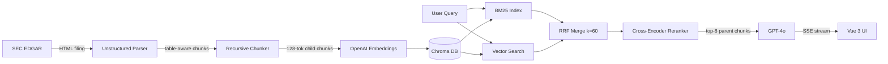

# SEC Insight

> Conversational querying of SEC 10-K/10-Q filings with hybrid search, cross-encoder reranking, and source highlighting.

**[Live Demo](https://sec-insight.vercel.app)** · **[Demo Video](#)** · 16 companies indexed

## What it does

Enter a stock ticker, ask questions about the company's SEC filing in plain English, and get grounded answers with source citations highlighted in the UI. Compare two companies side-by-side with an AI synthesis panel. Powered by hybrid BM25 + vector search, a cross-encoder reranker, and GPT-4o streaming.

## Architecture



## Technical highlights

| Feature | Details |
|---|---|
| **Table-aware parsing** | Unstructured preserves balance sheet rows/columns; naive text splitters mangle them |
| **Hybrid search** | BM25 + vector search merged with Reciprocal Rank Fusion (k=60) |
| **Cross-encoder reranking** | ms-marco-MiniLM-L-6-v2 re-scores top-20 candidates |
| **Small-to-big retrieval** | Embed 512-token child chunks, feed 2048-token parent chunks to LLM |
| **Section-aware boost** | Detects section-targeting queries (risk factors, MD&A) and injects matching chunks |
| **Source highlighting** | UI shows the exact paragraph the answer came from with rerank scores |
| **Structured output** | `/structured_query` endpoint returns typed JSON (Instructor + Pydantic) |
| **RAGAS eval harness** | Faithfulness + context precision measured against 20 ground-truth Q&A pairs |
| **LLM-as-a-judge** | GPT-4o scores every answer on accuracy, faithfulness, completeness |

## Benchmark results

Run `python evals/benchmark.py` to reproduce. Three configs evaluated against 20 hand-written ground-truth Q&A pairs (numeric, prose, table, cross-section, comparison categories).

| Configuration | Accuracy /5 | Faithfulness /5 | Completeness /5 | Avg Latency |
|---|---|---|---|---|
| Naive RAG (vector only) | — | — | — | — |
| **Hybrid RAG (ours)** | **—** | **—** | **—** | **—** |
| Long-context (full filing) | — | — | — | — |

> Fill in after running: `python evals/benchmark.py --output evals/benchmark_results.json`

## Stack

| Layer | Technology |
|---|---|
| Backend | FastAPI · Python 3.11 · Chroma · sentence-transformers |
| LLM | GPT-4o (streaming SSE) |
| Embeddings | text-embedding-3-small |
| Parsing | Unstructured |
| Frontend | Vue 3 · Vite · TypeScript |
| Evals | RAGAS · LLM-as-a-judge (GPT-4o) |
| Deploy | Railway (backend) · Vercel (frontend) · Docker |

## Running locally

```bash
# Clone
git clone https://github.com/neeilgupta/sec-insight.git
cd sec-insight

# Backend
python -m venv .venv && source .venv/bin/activate
pip install -r requirements.txt
cp .env.example .env
# Add OPENAI_API_KEY and SEC_USER_AGENT to .env

# Ingest a filing
python -m backend.ingestion.pipeline AAPL 10-K

# Start API
uvicorn backend.api.query:app --reload

# Frontend (separate terminal)
cd frontend && npm install && npm run dev
# Open http://localhost:5173
```

## Evals

```bash
# RAGAS metrics (faithfulness + context precision)
python evals/ragas_eval.py --output evals/ragas_results.json

# LLM-as-a-judge (accuracy / faithfulness / completeness per question)
python evals/llm_judge.py --output evals/judge_results.json

# Three-config benchmark (naive vs hybrid vs long-context)
python evals/benchmark.py --output evals/benchmark_results.json
```

## Deploy

```bash
# Local Docker
docker compose up

# Backend → Railway (auto-detects Dockerfile)
# Frontend → Vercel (Root: frontend, Build: npm run build, Output: dist)
# Set VITE_API_BASE in Vercel to your Railway URL
```
